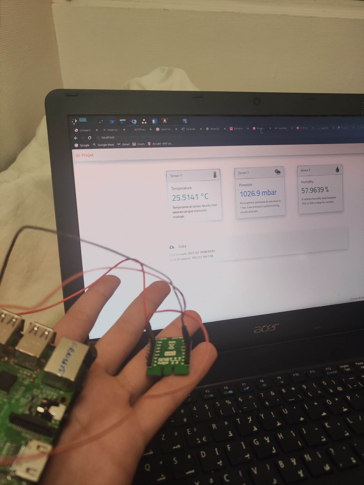

# IoT Project: Live Weather Station

An IoT project that focuses on building a live weather station using Raspberry Pi and the Adafruit BME280 sensor. The objective is to gather real-time local weather data and display it in an online dashboard.

## Dashboard

## Getting Started

To run this project, follow the steps below:

1. Clone this repository to your local machine.
2. Ensure you have the necessary prerequisites installed, including XAMPP, MySQL Workbench, a code editor (such as VS Code), and the latest version of Python.
3. Obtain a web hosting account that supports PHP and MySQL.
4. Connect a Raspberry Pi with the Adafruit BME280 sensor to serve as the IoT device.
5. Install Git for cloning the project.

## Project Workflow

The project operates as follows:

1. Python collects data from the Adafruit BME280 sensor and sends it via a POST request to the `data_collector.php` file on the webserver.
2. The `data_collector.php` file serves as the backend, receiving the data and storing it in a MySQL database.
3. The frontend file `iot_dashboard.php` retrieves the latest data from the MySQL database and displays it in the dashboard. It makes use of helper files such as `iot_dashboard_tiles.php` and `conn_php_math_db.php`.
4. Periodically, the `db_cleaner.php` file cleans up the database to maintain optimal size. It functions similarly to the `data_collector.php` file.

## Deployment

The deployment process for this project, both in local and production environments, is beyond the scope of this README. However, there are abundant online resources available for guidance. The code files contain comments to aid understanding.

## License

This repository is intended for non-commercial educational use only.

## Acknowledgements

Special thanks to the authors and contributors of the Adafruit BME280 library utilized in this project. The project was inspired by friends and members of the open-source community.
